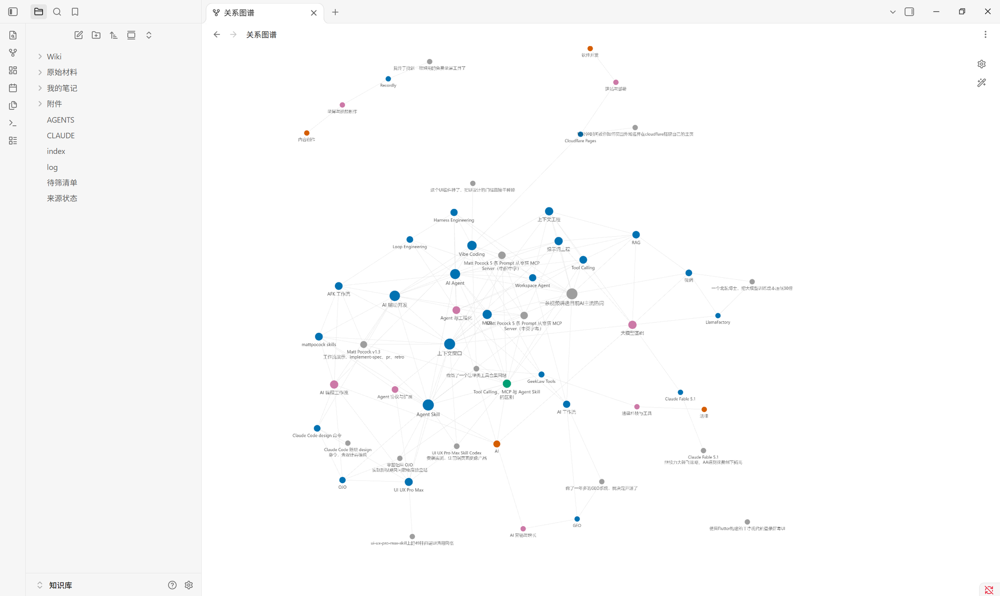
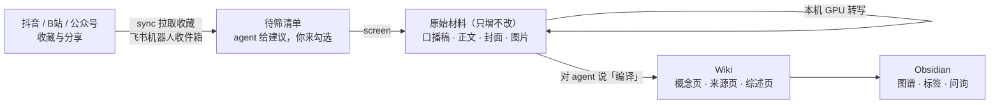

# sub2obsidian

**把你在抖音、B站、公众号收藏吃灰的知识视频和文章，变成一个会自己生长、每句话都能溯源到原视频秒数的 Obsidian 知识库。**


> 收藏 ≠ 学会。你收藏了几百条「AI 必学」「一条视频讲透」，它们散落在三个 App 里，搜不到、对不上、过两个月还可能被删。
>
> sub2obsidian 把它们统一采集下来，再交给 AI agent 按**概念**而不是按视频来整理：同一个概念的十条视频，最后汇成一页，各家说法并列，每一句都标着出自哪条视频的第几秒。

灵感来自 Andrej Karpathy 的 [LLM Wiki](https://gist.github.com/karpathy/442a6bf555914893e9891c11519de94f)：原始材料只存不改，由 LLM 把它们编译成互相链接的 Wiki，而不是每条内容生成一篇孤零零的摘要。

如果它对你有用，点个 ⭐ Star 是对这个项目最大的支持。

---

## 它和「AI 总结视频」工具有什么不同

| | 常见的 AI 总结工具 | sub2obsidian |
|---|---|---|
| 产出 | 每条视频一篇摘要 | 按概念组织的 Wiki：新视频讲了 MCP，就**改写已有的「MCP」页**，而不是再多一篇摘要 |
| 可信度 | 摘要里的话无从核对 | 每条论断都带出处，B站 出处**点击直接跳到原视频那一秒** |
| 观点冲突 | 后来的覆盖先前的 | 不同来源说法矛盾时**并列保留**，标上日期，等你裁决 |
| 原视频被删 | 摘要还在，原话没了 | 口播稿、正文、封面、配图全部**本地存档** |
| 隐私与成本 | 音频上传云端、按次付费 | 转写在**本机 GPU** 上完成；编译用你已有的 Claude Code，不另调 API |
| 改坏了 | 无法回退 | 知识库是 git 仓库，每次编译一次提交，**随时看 diff、随时回退** |

## 效果

下面是真实知识库里「MCP」概念页的片段（来自 2 条 B站 视频和 1 条抖音视频）：

> ## 定义
> MCP（Model Context Protocol）是连接 LLM 应用与外部能力的协议：开发者写一个 MCP server，在里面注册若干 tool；Cursor 等 MCP 客户端连上 server 后，客户端中的 LLM 就能根据用户的请求调用这些 tool，并拿到返回结果（[[Matt Pocock 5 条 Prompt 从零搭 MCP Server（中英字幕）]] [06:02](https://www.bilibili.com/video/BV1mubY6jE4u?p=1&t=362)；同内容版本：[[…（中配中字）]]）。
>
> MCP 可以理解成 AI 连接外部工具的标准协议，有点像 AI 世界里的 USB-C（[[一条视频讲透目前AI主流热词]] 05:43、05:55）。
>
> ## 要点
> - **控制 tool 返回的数据量**：GitHub API 原样返回的数据太多，全塞给 LLM 会很快耗尽[[上下文窗口|context window]]，应在 server 端删减（[[…]] [06:16](https://www.bilibili.com/video/BV1mubY6jE4u?p=1&t=376)）。

注意几个细节：
- 同一视频的「中英字幕版」和「中文配音版」被识别为**同内容版本**，只算一份证据，不会被当成「两方印证」。
- 抖音不支持按秒跳转，出处就写时间戳文本。
- 「上下文窗口」是另一个概念页，Wiki 内部全部用 Obsidian 双链连起来。

在 Obsidian 的关系图谱里，知识按「主题域 → 子主题 → 概念 → 来源」分层并着色。下图是验收时用 16 条真实收藏（B站、抖音、公众号）编译出的知识库：橙色是主题域，粉色是子主题，蓝色是概念，灰色是来源，绿色是综述。在标签面板里还可以按 `AI/AI编程工作流` 这样逐层展开。



除了编译，你还可以直接向知识库**提问**。回答只基于你收藏过的内容、逐条带出处；满意的回答说一句「存档」，就沉淀成一篇综述页。隔一段时间说一句「体检」，agent 会逐条核对所有出处、修断链、合并重复概念，并给出改进建议。

## 支持的平台

| 平台 | 批量导入已有收藏 | 日常新增 | 文字从哪来 |
|---|---|---|---|
| **B站** | ✅ 全部自建收藏夹 + 稍后再看 | 收藏夹同步，或分享给飞书机器人 | 优先用平台字幕（CC / AI 字幕），没有时本机转写 |
| **抖音** | ✅ 全部收藏与收藏夹 | 分享给飞书机器人 | 本机转写；图文帖保存正文与全部图片 |
| **公众号文章** | 逐篇转发 | 分享给飞书机器人 | 正文转 Markdown，配图下载到本地 |
| 微信「收藏」 | ❌ 不支持 | — | 唯一的途径是解密微信数据库，有法律和封号风险，见 [ADR-0002](docs/adr/0002-no-wechat-favorites-automation.md) |

B站 多P视频的每个分P是一条独立来源；没有人声的纯音乐、纯演示视频会被识别为「无口播」，只依据简介和封面整理，不会把转写幻觉写进知识库。

## 工作原理



分工很明确：
- **`sub2obsidian` 命令行**负责所有确定性的工作：登录、拉取、去重、下载、转写、存档、状态管理、git 提交。它**不调用任何大模型 API**。
- **AI agent**（Claude Code 等）负责需要判断力的工作：写来源页、合并概念、标注分歧、筛选建议、问询、体检。它的全部行为规则写在知识库里的 `CLAUDE.md` / `AGENTS.md`（Schema）中，你可以随时改；工具升级时，`upgrade-schema` 会保留你的改动、并入新规则。

为什么这样分工，见 [ADR-0001](docs/adr/0001-deterministic-cli-plus-agent-ingest.md)。

## 快速开始

### 准备

- Windows 10 / 11
- NVIDIA 显卡：本机转写需要 CUDA，已在 RTX 4060 8GB 上验证
- [uv](https://docs.astral.sh/uv/)、[Git for Windows](https://git-scm.com/download/win)、[Obsidian](https://obsidian.md/)
- [Claude Code](https://claude.com/claude-code)：用来编译与问询。知识库同时提供 `AGENTS.md`，理论上也可以用 Codex 等读取 `AGENTS.md` 的 agent，但目前只在 Claude Code 上验证过。

### 安装

```powershell
git clone https://github.com/f4de01/sub2obsidian.git
cd sub2obsidian

# 安装命令行工具（含抖音需要的 F2）
uv tool install --with "f2 @ git+https://github.com/Johnserf-Seed/f2@f6be8c0ffba9a127075bbeafe4838716650b6325" .

# 扫码登录用的专用浏览器
& "$(uv tool dir)\sub2obsidian\Scripts\python.exe" -m playwright install chromium

# 提取音频用的 ffmpeg（装好后重新打开终端）
winget install --id Gyan.FFmpeg -e
```

### 五分钟跑通第一条

```powershell
sub2obsidian init                    # 新建知识库，默认 D:\Obsidian\知识库
sub2obsidian login bilibili          # 弹出窗口，扫码登录
sub2obsidian capture "https://www.bilibili.com/video/BV1mubY6jE4u"
```

然后在知识库目录里打开 Claude Code，说一句 **「编译」**，回到 Obsidian 看看生成的概念页。

### 日常使用

1. 看到好内容，在手机上**分享给飞书里的 sub2obsidian 机器人**。配置一次即可，向导会带你走完：`bash scripts/feishu-inbox-setup.sh`。
2. 电脑上运行 **`sub2obsidian sync`**：读取收件箱，分批回填 B站 / 抖音收藏，采集并转写。
3. 回填进来的收藏先进入 `待筛清单.md`。对 agent 说「填写筛选建议」，你勾选要保留的，再运行 **`sub2obsidian screen`**。
4. 攒够一批，对 agent 说 **「编译」**。
5. 有问题直接问；好的回答说「存档」；隔一阵说「体检」。

所有命令、配置项和流程细节见 **[使用手册](docs/使用手册.md)**。

## 知识库长什么样

```text
知识库/
├── 原始材料/              # 只增不改的存档：bilibili/ douyin/ wechat/ 下每条来源一个目录
├── Wiki/
│   ├── 主题域/            # AI、法律……
│   ├── 子主题/            # AI 编程工作流、Agent 协议与扩展……
│   ├── 概念/              # 主产物：MCP、RAG、Vibe Coding……
│   ├── 来源/              # 每条视频 / 文章的摘要页，作为概念页的证据
│   └── 综述/              # 你让 agent 存档的问答
├── 我的笔记/              # 你自己写的，agent 只读、优先级最高
├── 待筛清单.md
├── 来源状态.md            # Dataview 统计
├── index.md · log.md
└── CLAUDE.md · AGENTS.md  # Schema：agent 的全部行为规则
```

你在概念页里写的 `> [!我]` 批注，agent 改写页面时会原样保留。

## 常见问题

**会消耗很多 token 吗？**
命令行工具本身不调用任何大模型，不花 token。只有编译、问询、体检这些在 agent 会话里做的事才会消耗，用的是你自己的 Claude Code 额度。建议攒一批再编译。

**会被平台封号吗？**
工具只用你自己的账号、只读你自己的收藏，请求之间有随机间隔，每次只回填一小批，且只在你手动运行 `sync` 时才请求。即便如此，平台的风控规则不透明，风险无法完全排除；抖音最严，所以抖音收藏只回填一次，之后改用分享推送。

**抖音或 B站 改版后抓不到了怎么办？**
先升级依赖（命令见使用手册）。三个平台的采集各自独立，一个失效不影响其他平台。抓取持续失败时，计划改用付费的 TikHub 接口作为备选，见 [ADR-0003](docs/adr/0003-open-source-scrapers-first-tikhub-fallback.md)。

**没有 NVIDIA 显卡 / 用 Mac 可以吗？**
目前不行：转写依赖 CUDA。B站 有字幕的视频和公众号文章用不到显卡，但其余视频需要转写。CPU 与 macOS 支持在计划中，欢迎 PR。

**凭据安全吗？**
登录状态保存在工具专用的浏览器配置里（`%APPDATA%\sub2obsidian\`），不读取你日常使用的浏览器，也绝不会写进知识库或任何 git 仓库。

## 路线图

- [ ] CPU / macOS 转写
- [ ] 更多平台：小红书、知乎、YouTube
- [ ] TikHub 备选采集通道
- [ ] 定时自动 `sync`
- [ ] 中文转写引擎对比（FunASR / SenseVoice）

欢迎在 [Issues](https://github.com/f4de01/sub2obsidian/issues) 里提需求，或者告诉我你最想接入哪个平台。

## 相关项目与致谢

这个方向已经有不少优秀的项目，按你的需要也许它们更合适：

| 项目 | 适合你，如果你想要…… | 和 sub2obsidian 的区别 |
|---|---|---|
| [Karpathy 的 LLM Wiki](https://gist.github.com/karpathy/442a6bf555914893e9891c11519de94f) | 理解这套方法论本身 | 本项目的思想来源 |
| [llm-wiki-skill](https://github.com/sdyckjq-lab/llm-wiki-skill) | 一个通用的中文 LLM Wiki skill，逐条喂入公众号、知乎、YouTube 链接 | 不批量导入收藏，不支持 B站 / 抖音视频转写 |
| [claude-obsidian](https://github.com/AgriciDaniel/claude-obsidian)、[llm_wiki](https://github.com/nashsu/llm_wiki) | 用 Claude Code 或桌面应用把文档编译成 Wiki | 面向通用文档，没有视频平台采集 |
| [BiliNote](https://github.com/JefferyHcool/BiliNote) | 给单个视频生成带跳转时间戳和截图的笔记 | 一条视频一篇笔记，不汇总成概念页 |
| [bilibili-rag](https://github.com/via007/bilibili-rag) | 对 B站 收藏夹做向量检索、聊天问答 | 走 RAG 检索问答，不生成可阅读的 Wiki |
| [douyin-favorites-to-knowledge](https://github.com/tars1230/douyin-favorites-to-knowledge) | 把抖音收藏批量转成 Markdown 笔记和每日摘要 | 只支持抖音，一条视频一篇笔记 |

sub2obsidian 想补上的是：**三个平台的收藏一起批量导入**，并且编译成**每条论断都能追溯到原视频秒数的概念 Wiki**。

站在这些开源项目的肩膀上：[yt-dlp](https://github.com/yt-dlp/yt-dlp)、[F2](https://github.com/Johnserf-Seed/f2)、[faster-whisper](https://github.com/SYSTRAN/faster-whisper)、[Playwright](https://playwright.dev/python/)、[Dataview](https://github.com/blacksmithgu/obsidian-dataview)、[飞书开放平台 SDK](https://github.com/larksuite/oapi-sdk-python)。

## 参与开发

```powershell
uv sync
uv run pytest -q
$env:PYTHONUTF8 = "0"; uv run pytest -q -p no:cacheprovider   # 也要在非 UTF-8 模式下通过（中文 Windows 默认）
```

- 领域术语：[CONTEXT.md](CONTEXT.md)
- 架构决策：[docs/adr/](docs/adr/)
- 完整行为说明：[使用手册](docs/使用手册.md)

## 许可证与声明

代码以 [MIT](LICENSE) 许可证开源。

本项目仅供个人学习与知识管理使用。请只采集你自己账号下的收藏，遵守各平台的用户协议，尊重原作者的版权：采集到的内容只应留在你自己的本地知识库里，不要再分发。

---

如果 sub2obsidian 帮你把收藏夹真正变成了知识，欢迎点一个 ⭐，也欢迎分享给同样「收藏从不看」的朋友。
